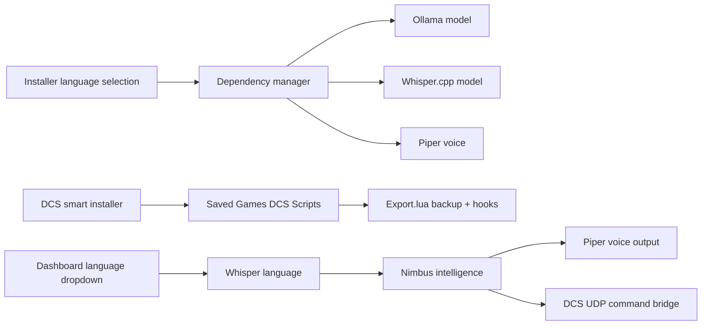

# Voice-Comms-DCS / Nimbus

Voice-Comms-DCS is a local-first Windows companion app for DCS World. It started as a safe voice-command-to-DCS-flag bridge and now includes **Nimbus**, a multilingual telemetry-aware AI wingman stack with WebRTC audio, HOTAS/keyboard push-to-talk, Whisper.cpp STT, local Ollama orchestration, Piper radio-effect TTS, a browser-based dashboard, and a zero-touch installer path.



## Supported languages

Nimbus supports these UI, STT/TTS routing, and AI response languages:

| Code | Language |
|---|---|
| `en` | English |
| `zh` | Chinese |
| `ko` | Korean |
| `fr` | French |
| `ru` | Russian |
| `es` | Spanish |

English can use English-only Whisper models such as `ggml-base.en.bin`. Chinese, Korean, French, Russian, and Spanish require multilingual Whisper weights such as `ggml-base.bin`.

Korean TTS note: the current Korean Piper-compatible voice is a community model, not from the official `rhasspy/piper-voices` tree. Review its upstream licence before commercial use.

## Automated setup

The Phase 4 installer is designed to handle the main setup steps automatically:

1. Detect DCS Saved Games folders, including moved Saved Games locations.
2. Copy `VoiceBridge.lua` and `dcs_telemetry.lua` into each discovered DCS `Scripts` folder.
3. Back up `Export.lua` before patching.
4. Add marked, uninstallable Voice-Comms-DCS hook blocks.
5. Download selected Ollama, Whisper.cpp, and Piper model files.
6. Install selected language UI files and model mappings.

Manual equivalent:

```powershell
voice-comms-dcs --install-lua --dcs-source-dir dcs_scripts
```

```powershell
voice-comms-dcs --setup-dependencies-ui --languages en fr es --ollama-model qwen2.5:0.5b --whisper-quality base
```

Uninstall equivalent:

```powershell
voice-comms-dcs --uninstall-lua
voice-comms-dcs --remove-dependencies --languages en zh ko fr ru es
```

## Local model profiles

Voice-Comms-DCS keeps safety-critical actions deterministic, so the LLM can stay small. Commands go through configured phrases and DCS flags, while telemetry questions are answered from JSON telemetry.

| Component | Minimum profile | Recommended low-load profile |
|---|---|---|
| Ollama LLM | `qwen2.5:0.5b` | `qwen2.5:1.5b` |
| Whisper STT | `tiny` / `tiny.en` | `base` / `base.en` |
| Piper TTS | language-specific low/medium voice | same |

Recommended English-only minimum:

```powershell
voice-comms-dcs --setup-dependencies-ui --languages en --ollama-model qwen2.5:0.5b --whisper-quality base
```

Recommended global six-language install:

```powershell
voice-comms-dcs --setup-dependencies-ui --languages en zh ko fr ru es --ollama-model qwen2.5:0.5b --whisper-quality base
```

## Dashboard workflow

Start the WebRTC bridge:

```powershell
voice-comms-dcs-webrtc `
  --config config\commands.json `
  --aircraft-profile config\aircraft_profiles\su57.json `
  --joystick-index 0 `
  --joystick-button 1 `
  --ptt-hotkey right_ctrl
```

The bridge prints a local dashboard URL at startup. Open that exact URL:

```text
Dashboard: http://127.0.0.1:8765/dashboard?token=<startup-token>
```

Dashboard, API, WebSocket, and WebRTC control routes require this token by default. The browser stores it in session storage and removes it from the visible URL after loading the dashboard. You can supply a stable token for a local session with `--dashboard-token`, but do not store real tokens in config files.

The dashboard provides:

- WebRTC microphone connection.
- HOTAS/keyboard PTT state.
- Language dropdown.
- Pilot/Nimbus conversation terminal.
- STT transcript and latency events.
- Fuel, altitude, airspeed, and G-load gauges.
- Current telemetry context window.

## Language switching

You can change language in the dashboard dropdown. The backend then updates:

- Whisper language code.
- Whisper model path, using multilingual weights for non-English where available.
- Piper voice model path.
- Nimbus local LLM language instruction.
- Deterministic telemetry answer language.

Manual launch example for Spanish:

```powershell
voice-comms-dcs-webrtc --language es --config config\commands.json
```

## DCS integration details

The smart installer searches for DCS folders under Saved Games, including users who moved Saved Games to another drive via Windows shell folder settings. It patches `Export.lua` using marked blocks:

```lua
-- BEGIN VOICE_COMMS_DCS_BRIDGE
-- END VOICE_COMMS_DCS_BRIDGE

-- BEGIN VOICE_COMMS_DCS_TELEMETRY
-- END VOICE_COMMS_DCS_TELEMETRY
```

Before patching an existing `Export.lua`, it creates:

```text
Export.lua.voice-comms-dcs.bak
```

DCS actions still use the safe command protocol:

```text
VCDCS|request_tanker|flag|5101|1
```

The Lua bridge validates the packet and sets user flags for mission-owned logic.

## Hardware and storage guidance

Approximate additional storage:

| Install type | Typical extra storage |
|---|---:|
| English-only minimum | ~700 MB to 1 GB |
| Six-language install | ~1.2 GB to 2 GB+ |
| Larger LLM / Whisper models | More than 2 GB |

Recommended runtime baseline:

- 32 GB RAM minimum; 64 GB preferred for DCS plus local AI.
- Modern 8-core CPU minimum; 12-core+ preferred.
- Keep telemetry at 10 Hz unless tested.
- Start with `qwen2.5:0.5b`; upgrade to `qwen2.5:1.5b` only if DCS remains smooth.

## Troubleshooting

### DCS folder not detected

```powershell
voice-comms-dcs --install-lua --saved-games "D:\Saved Games"
```

### Export.lua conflict

Run:

```powershell
voice-comms-dcs --uninstall-lua
```

Or restore:

```text
Export.lua.voice-comms-dcs.bak
```

### Model download interrupted

Run the same dependency command again. Whisper and Piper downloads use `.part` files and HTTP range resume when supported. Ollama pulls can be re-run and reuse already downloaded layers.

### Non-English STT does not work correctly

Install multilingual Whisper weights:

```powershell
voice-comms-dcs --setup-dependencies-ui --languages zh ko fr ru es --whisper-quality base --skip-ollama --skip-piper
```

Avoid `ggml-base.en.bin` for non-English speech.

### Piper voice missing

Install the selected language voice:

```powershell
voice-comms-dcs --setup-dependencies-ui --languages es --skip-ollama --skip-whisper
```

## Runtime architecture

Nimbus has three runtime paths: microphone audio into speech recognition, DCS telemetry into the context window, and Nimbus responses back out to the pilot or the mission.

```mermaid
flowchart LR
    Mic[Microphone/PTT] -- audio --> WebRTC[WebRTC bridge<br/>webrtc_bridge.py]
    WebRTC -- audio --> Whisper[Whisper STT engine<br/>stt_whisper_engine.py]
    Whisper -- audio --> Nimbus[Nimbus intelligence<br/>nimbus_intelligence.py]

    DCS[DCS World] -- UDP telemetry --> TelemetryLua[dcs_telemetry.lua<br/>Export.lua hook<br/>non-blocking UDP send]
    TelemetryLua -- UDP telemetry --> UdpSocket[UDP socket<br/>10 Hz]
    UdpSocket -- UDP telemetry --> Receiver[Python telemetry receiver]
    Receiver -- UDP telemetry --> Context[Nimbus context window]
    Context --> Nimbus

    Nimbus -- TTS response --> Piper[Piper TTS<br/>radio_voice.py]
    Piper -- TTS response --> Speaker[Speaker<br/>WebRTC audio out]

    Nimbus -- UDP command --> Handler[Deterministic command handler]
    Handler -- UDP command --> VoiceBridge[VoiceBridge.lua]
    VoiceBridge -- UDP command --> Flag[DCS user flag]
```



### Graceful degradation

Nimbus is designed to keep mission-owned command behaviour deterministic even when local AI components are unavailable.

- If Ollama is unavailable or too slow, Nimbus returns `Comms system offline, wingman unavailable. Commands still active.` Deterministic voice commands still work, telemetry still streams, and unrecognised LLM queries receive the offline notice.
- If the Whisper model fails to load, PTT input should be disabled and the dashboard should show a warning while telemetry and gauges continue to function (planned).
- If DCS is not running, the telemetry socket receives no data. Nimbus operates in no-telemetry mode and answers without aircraft context.
- If Piper TTS fails, Nimbus should keep returning text output to the dashboard terminal and skip spoken audio for that response (planned).

### Context window and state management

Conversation history is held in memory by `NimbusIntelligence` through the runtime `ContextManager`. It is not written to disk and does not persist across app restarts.

The conversation window is deliberately small because Nimbus runs against local models. The context manager keeps a bounded tail of recent turns, and `NimbusIntelligence.trim_history_if_needed()` also estimates the token load using a simple `words × 1.3` approximation. When the estimate exceeds `NIMBUS_CONTEXT_LIMIT` (default `2048`), the oldest user/assistant turns are dropped while the system prompt and the latest turns are kept.

Telemetry is not appended to conversation history. Instead, the current telemetry snapshot is formatted as a separate system-context block when a Whisper trigger or text input is handled. This keeps fast-changing aircraft state from polluting the chat history.

The decision boundary is deterministic first: recognised command phrases are matched and dispatched by the command handler before any LLM call. Direct telemetry questions are answered from the current telemetry JSON. Only unrecognised conversational queries are routed to Ollama.

## Project layout

```text
voice-comms-dcs/
├── config/
│   ├── commands.example.json
│   ├── aircraft_profiles/
│   └── i18n/
├── dcs_scripts/
│   ├── VoiceBridge.lua
│   └── dcs_telemetry.lua
├── src/voice_comms_dcs/
│   ├── dcs_installer_utils.py
│   ├── dependency_manager.py
│   ├── dependency_setup_ui.py
│   ├── language_models.py
│   ├── nimbus_intelligence.py
│   ├── radio_voice.py
│   ├── stt_whisper_engine.py
│   ├── webrtc_bridge.py
│   └── web_ui/
├── build/
│   ├── build_exe.ps1
│   ├── setup_local_models.ps1
│   ├── setup_whisper.ps1
│   ├── pyinstaller.spec
│   └── voice-comms-dcs.iss
└── docs/
    ├── lua-timing-guide.md
    ├── model_selection.md
    ├── phase4_global_deployment.md
    ├── rwr-adapter-spec.md
    ├── security_report.md
    └── srs-integration-spec.md
```

## Build and installer

Build the PyInstaller output:

```powershell
.\build\build_exe.ps1
```

Then compile:

```text
build\voice-comms-dcs.iss
```

The Inno Setup installer includes language model checkboxes and can run the Lua bridge installer and model downloader after installation.

## Security posture

Voice-Comms-DCS is local-first by default. The dashboard/WebRTC bridge binds to `127.0.0.1`, generates a startup token, and accepts browser origins only from `localhost` or `127.0.0.1` on the configured port unless extra origins are supplied with `--allowed-origin`.

LAN binding is refused unless `--allow-lan` is passed, and dashboard authentication must remain enabled for LAN/non-local hosts. `--disable-dashboard-auth` is intended only for local development on localhost. Do not expose `/dashboard`, `/ws`, `/api/live`, or dashboard API routes to the public internet.

## Roadmap

- Backend wiring for dashboard personality toggle (planned).
- Browser UI polishing and aircraft-specific skins (planned).
- Joystick profile presets for Warthog, Winwing, T16000M, Logitech, and Viper panels (planned).
- SRS-specific audio injection path (spec: `docs/srs-integration-spec.md`).
- Aircraft-specific RWR adapters (spec: `docs/rwr-adapter-spec.md`).
- DCS Lua timing and non-blocking export guidance (spec: `docs/lua-timing-guide.md`).
- Signed installer and model checksum manifest (under evaluation).

## License

MIT License. See `LICENSE`.
