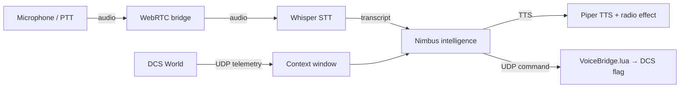

# Voice-Comms-DCS / Nimbus

Voice-Comms-DCS is a local-first Windows companion app for DCS World. It bridges voice commands directly to DCS mission flags and wraps **Nimbus** — a multilingual, telemetry-aware AI wingman with WebRTC audio, HOTAS/keyboard push-to-talk, Whisper.cpp STT, local Ollama LLM, Piper radio-effect TTS, and a browser-based dashboard.

All AI runs locally. No cloud accounts or API keys are required.

> **Full setup and usage guide:** [`docs/USER_MANUAL.md`](docs/USER_MANUAL.md)



## Quick start

### 1. Install dependencies

```powershell
voice-comms-dcs --setup-dependencies-ui --languages en --ollama-model qwen2.5:0.5b --whisper-quality base
```

### 2. Install the DCS Lua bridge

```powershell
voice-comms-dcs --install-lua
```

### 3. Start the dashboard

```powershell
voice-comms-dcs-webrtc --config config\commands.json
```

Open the URL printed at startup (e.g. `http://127.0.0.1:8765/dashboard?token=…`).

## Supported languages

| Code | Language | Notes |
|------|----------|-------|
| `en` | English | English-only Whisper model available (`ggml-base.en.bin`) |
| `zh` | Chinese | Requires multilingual Whisper weights |
| `ko` | Korean | Community Piper voice — check licence before commercial use |
| `fr` | French | Requires multilingual Whisper weights |
| `ru` | Russian | Requires multilingual Whisper weights |
| `es` | Spanish | Requires multilingual Whisper weights |

## Recommended model profiles

| Profile | Ollama | Whisper | Storage |
|---------|--------|---------|---------|
| Minimum | `qwen2.5:0.5b` | `base.en` | ~700 MB |
| Recommended | `qwen2.5:1.5b` | `base.en` | ~1.3 GB |
| Six-language | `qwen2.5:0.5b` | `base` (multilingual) | ~1.5 GB |

Commands and telemetry answers are fully deterministic — the LLM handles only conversational wingman queries, making small models sufficient.

## Hardware requirements

- Windows 10/11 64-bit
- 32 GB RAM minimum (64 GB recommended — DCS and local AI run simultaneously)
- Modern 8-core CPU; 12-core+ preferred
- ~1–2 GB free disk space for models

## Project layout

```text
voice-comms-dcs/
├── config/
│   ├── commands.example.json      # Voice command definitions template
│   ├── aircraft_profiles/         # Per-aircraft Nimbus personality profiles
│   ├── rwr/adapters.json          # Radar warning receiver adapter registry
│   └── srs/srs_audio.json         # SRS integration settings
├── dcs_scripts/
│   ├── VoiceBridge.lua            # Command receiver (DCS flag setter)
│   └── dcs_telemetry.lua          # Telemetry exporter (UDP sender)
├── src/voice_comms_dcs/           # Python source
│   └── web_ui/                    # Browser dashboard (HTML/JS/CSS)
├── docs/
│   └── USER_MANUAL.md             # Full user guide
└── build/                         # PyInstaller + Inno Setup scripts
```

## Uninstall

```powershell
voice-comms-dcs --uninstall-lua
voice-comms-dcs --remove-dependencies --languages en zh ko fr ru es
```

## Security

The dashboard binds to `127.0.0.1` and requires a per-session token by default. LAN binding requires `--allow-lan`. Do not expose dashboard routes to the public internet. See [`docs/USER_MANUAL.md`](docs/USER_MANUAL.md#security) for details.

## Build

```powershell
.\build\build_exe.ps1
# Then compile build\voice-comms-dcs.iss with Inno Setup
```

## License

MIT License. See [`LICENSE`](LICENSE).
