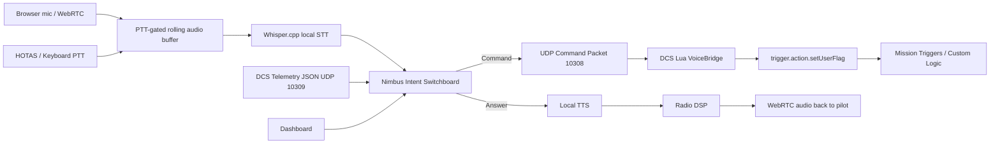

# Voice-Comms-DCS

Voice-Comms-DCS is a local-first Windows companion app for DCS World. It started as a safe voice-command-to-DCS-flag bridge and now includes **Nimbus**, a telemetry-aware AI wingman stack with WebRTC audio, HOTAS/keyboard push-to-talk, Whisper.cpp STT, local LLM orchestration, radio-effect TTS, and a browser-based glass-cockpit dashboard.



## Why this exists

DCS F10 radio menus are powerful but slow to use during high workload flying. Voice-Comms-DCS lets mission builders map phrases such as `request tanker`, `bogey dope`, `gear down`, or `abort mission` to deterministic DCS trigger flags.

Nimbus extends this into a two-way AI wingman/RIO/ATC assistant that can answer telemetry questions such as `what is my fuel?`, keep responses short in combat, and speak back through a cockpit-radio-style voice.

## Important DCS limitation

DCS does not provide a simple public API for externally "clicking" any currently visible dynamic F10 menu item. The reliable approach is to design missions so voice commands set mission user flags, and mission triggers or Lua scripts then perform the desired action. Future adapters can target DCS-BIOS, DCS-gRPC, SRS, or a custom mission menu registry for deeper dynamic-menu awareness.

## Repository layout

```text
voice-comms-dcs/
├── README.md
├── LICENSE
├── requirements.txt
├── pyproject.toml
├── src/voice_comms_dcs/
│   ├── api_routes.py
│   ├── input_manager.py
│   ├── stt_whisper_engine.py
│   ├── webrtc_bridge.py
│   ├── nimbus_intelligence.py
│   ├── context_manager.py
│   ├── telemetry_listener.py
│   ├── radio_voice.py
│   ├── web_ui/
│   │   ├── index.html
│   │   ├── app.js
│   │   └── style.css
│   └── ...
├── dcs_scripts/
│   ├── VoiceBridge.lua
│   ├── dcs_telemetry.lua
│   ├── Export.lua.append.example
│   └── mission_trigger_example.lua
├── config/
│   ├── commands.example.json
│   └── aircraft_profiles/
│       ├── default.json
│       └── su57.json
├── docs/
│   ├── architecture.md
│   ├── phase2_conversational_cockpit.md
│   ├── phase3_frontend_high_fidelity.md
│   ├── security_report.md
│   ├── installer_roadmap.md
│   └── security_and_limitations.md
└── build/
    ├── build_exe.ps1
    ├── setup_whisper.ps1
    ├── pyinstaller.spec
    └── voice-comms-dcs.iss
```

## Quick start

### 1. Install Python dependencies

Use Python 3.11 or newer on Windows.

```powershell
python -m venv .venv
.\.venv\Scripts\Activate.ps1
python -m pip install --upgrade pip
pip install -r requirements.txt
pip install -e .
```

### 2. Copy the command configuration

```powershell
copy config\commands.example.json config\commands.json
```

Edit `config\commands.json` for your command phrases, HOTAS button, keyboard PTT key, Whisper model path, and local model settings.

### 3. Install Whisper.cpp model

Start with `base.en` for the best balance. Use `tiny.en` if you need lower latency.

```powershell
.\build\setup_whisper.ps1 -Model base.en
```

This creates:

```text
models\whisper\ggml-base.en.bin
```

### 4. Install the DCS Lua bridge and telemetry exporter

Copy these files into:

```text
%USERPROFILE%\Saved Games\DCS\Scripts\
```

Required files:

```text
dcs_scripts\VoiceBridge.lua
dcs_scripts\dcs_telemetry.lua
```

Then append the content of `dcs_scripts/Export.lua.append.example` to:

```text
%USERPROFILE%\Saved Games\DCS\Scripts\Export.lua
```

If `Export.lua` does not exist, create it first.

### 5. Wire flags inside your mission

Use Mission Editor triggers or `DO SCRIPT` logic to respond to the flags sent by the app.

```lua
if trigger.misc.getUserFlag("5101") == 1 then
    trigger.action.outText("Voice command received: Request Tanker", 10)
    trigger.action.setUserFlag("5101", 0)
end
```

A fuller example is provided in `dcs_scripts/mission_trigger_example.lua`.

## Phase 3 dashboard workflow

### 1. Identify your HOTAS button

```powershell
voice-comms-dcs-input --list
```

Then test a specific button and keyboard key:

```powershell
voice-comms-dcs-input --joystick-index 0 --button-index 1 --hotkey right_ctrl
```

The joystick listener uses `pygame.joystick` polling and does not take exclusive control of the device, so DCS should still receive its native input.

### 2. Launch Nimbus WebRTC bridge

```powershell
voice-comms-dcs-webrtc `
  --config config\commands.json `
  --aircraft-profile config\aircraft_profiles\su57.json `
  --whisper-model models\whisper\ggml-base.en.bin `
  --joystick-index 0 `
  --joystick-button 1 `
  --ptt-hotkey right_ctrl
```

### 3. Open the dashboard

```text
http://127.0.0.1:8765/dashboard
```

Click **Connect WebRTC**, allow microphone access, then use your HOTAS/keyboard PTT. The dashboard shows:

- WebRTC connection state.
- PTT state.
- Pilot/Nimbus conversation terminal.
- STT transcript and latency events.
- Live fuel, altitude, airspeed, and G-load gauges.
- Current telemetry context window.
- Manual transcript testing.

## Useful diagnostics

### Test command matching without audio

```powershell
voice-comms-dcs --config config\commands.json --test-phrase "request tanker"
```

### Test Nimbus intent handling

```powershell
voice-comms-dcs-nimbus --config config\commands.json --text "what is my fuel" --no-llm
```

### Test telemetry listener

```powershell
voice-comms-dcs-telemetry --host 127.0.0.1 --port 10309
```

### Test Whisper transcription from a WAV file

```powershell
voice-comms-dcs-whisper --model models\whisper\ggml-base.en.bin --wav samples\test_command.wav
```

### Generate a radio-effect TTS WAV

```powershell
voice-comms-dcs-radio-voice --text "Two, contact bandit, two o'clock, five miles" --output build_output\nimbus_radio.wav
```

## Default local endpoints

| Service | Port | Protocol |
|---|---:|---|
| Command bridge | 10308 | UDP Python -> DCS |
| Telemetry stream | 10309 | UDP DCS -> Python |
| WebRTC signaling/dashboard | 8765 | HTTP/WebSocket local only |
| Ollama local model | 11434 | HTTP local only |

## UDP command protocol

The desktop app sends one UDP packet per matched command:

```text
VCDCS|<command_id>|<action_type>|<param1>|<param2>
```

For a user flag command:

```text
VCDCS|request_tanker|flag|5101|1
```

The Lua bridge validates the `VCDCS` prefix, parses the fields, then calls `trigger.action.setUserFlag(flag, value)` when the mission scripting environment permits it.

## Telemetry protocol

DCS sends compact JSON packets to UDP `127.0.0.1:10309` with internal, spatial, and tactical state, including fuel, RPM, flaps, gear, G-load, heading, altitude, airspeed, coordinates, locked target info, and RWR alert placeholders.

## Security posture

Voice-Comms-DCS is local-first by default. Keep the WebRTC bridge bound to `127.0.0.1` unless you intentionally add authentication and firewall controls. See `docs/security_report.md` for microphone, WebRTC, UDP, HID, and model supply-chain notes.

## Packaging

The repository includes:

- `build/pyinstaller.spec` for a one-folder Windows build.
- `build/build_exe.ps1` for repeatable local packaging.
- `build/voice-comms-dcs.iss` as an Inno Setup installer template.
- `build/setup_whisper.ps1` for Whisper model setup.

TTS binaries and model files are not committed. Piper/Kokoro models should be installed locally or bundled later through an explicit installer option.

## Roadmap

- Backend wiring for dashboard personality toggle.
- Browser UI polishing and aircraft-specific skins.
- Joystick profile presets for Warthog, Winwing, T16000M, Logitech, and Viper panels.
- SRS-specific audio injection path.
- Aircraft-specific RWR adapters.
- DCS runtime benchmark tests and tuning guide.
- Signed installer and model checksum manifest.

## License

MIT License. See `LICENSE`.
