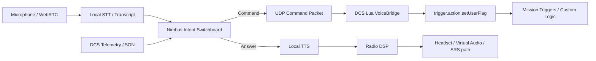

# Voice-Comms-DCS

Voice-Comms-DCS is a local-first Windows companion app for DCS World. Phase 1 provides a safe voice-command-to-DCS-flag bridge. Phase 2 adds the **Nimbus conversational cockpit**: a WebRTC audio bridge, DCS telemetry ingestion, local AI intent handling, and radio-effect TTS feedback.

The project is designed around a safe and mission-author-controlled bridge:



## Why this exists

DCS F10 radio menus are powerful but slow to use during high workload flying. This tool provides a configurable voice layer so mission builders can map phrases such as `request tanker`, `bogey dope`, `gear down`, or `abort mission` to deterministic DCS trigger flags.

Phase 2 extends this into a two-way AI wingman/RIO/ATC assistant that can answer telemetry questions such as `what is my fuel?`, keep responses short in combat, and speak back through a cockpit-radio-style voice.

## Important DCS limitation

DCS does not provide a simple public API for externally "clicking" any currently visible dynamic F10 menu item. The reliable approach is to design missions so voice commands set mission user flags, and mission triggers or Lua scripts then perform the desired action. Future adapters can target DCS-BIOS, DCS-gRPC, SRS, or a custom mission menu registry for deeper dynamic-menu awareness.

## Repository layout

```text
voice-comms-dcs/
├── README.md
├── LICENSE
├── requirements.txt
├── pyproject.toml
├── .gitignore
├── src/voice_comms_dcs/
│   ├── __init__.py
│   ├── __main__.py
│   ├── main.py
│   ├── app.py
│   ├── aircraft_profiles.py
│   ├── audio.py
│   ├── config.py
│   ├── context_manager.py
│   ├── matcher.py
│   ├── network.py
│   ├── nimbus_intelligence.py
│   ├── radio_voice.py
│   ├── stt.py
│   ├── telemetry_listener.py
│   ├── ui.py
│   ├── webrtc_audio_server.py
│   └── webrtc_bridge.py
├── dcs_scripts/
│   ├── VoiceBridge.lua
│   ├── dcs_telemetry.lua
│   ├── Export.lua.append.example
│   └── mission_trigger_example.lua
├── config/
│   ├── commands.example.json
│   └── aircraft_profiles/
│       ├── default.json
│       └── su57.json
├── docs/
│   ├── architecture.md
│   ├── phase2_conversational_cockpit.md
│   ├── installer_roadmap.md
│   └── security_and_limitations.md
└── build/
    ├── build_exe.ps1
    ├── pyinstaller.spec
    └── voice-comms-dcs.iss
```

## Quick start

### 1. Install Python dependencies

Use Python 3.11 or newer on Windows.

```powershell
python -m venv .venv
.\.venv\Scripts\Activate.ps1
python -m pip install --upgrade pip
pip install -r requirements.txt
pip install -e .
```

### 2. Copy the command configuration

```powershell
copy config\commands.example.json config\commands.json
```

Edit `config\commands.json` and map your spoken phrases to DCS user flags.

### 3. Install the DCS Lua bridge and telemetry exporter

Copy these files into:

```text
%USERPROFILE%\Saved Games\DCS\Scripts\
```

Required files:

```text
dcs_scripts\VoiceBridge.lua
dcs_scripts\dcs_telemetry.lua
```

Then append the content of `dcs_scripts/Export.lua.append.example` to:

```text
%USERPROFILE%\Saved Games\DCS\Scripts\Export.lua
```

If `Export.lua` does not exist, create it first.

### 4. Wire flags inside your mission

Use Mission Editor triggers or `DO SCRIPT` logic to respond to the flags sent by the app.

Example:

```lua
-- When flag 5101 becomes 1, run tanker request logic, then reset it.
if trigger.misc.getUserFlag("5101") == 1 then
    trigger.action.outText("Voice command received: Request Tanker", 10)
    trigger.action.setUserFlag("5101", 0)
end
```

A fuller example is provided in `dcs_scripts/mission_trigger_example.lua`.

### 5. Validate Phase 1 command matching without the GUI

```powershell
voice-comms-dcs --config config\commands.json --test-phrase "request tanker"
```

You can also run the package module directly:

```powershell
python -m voice_comms_dcs --config config\commands.json --test-phrase "request tanker"
```

### 6. Run the Phase 1 desktop app

```powershell
voice-comms-dcs --config config\commands.json
```

Use the GUI to start listening. You can also type a phrase into the manual test box to validate command matching before connecting a microphone.

## Phase 2: Nimbus conversational cockpit

### Run the telemetry listener

```powershell
voice-comms-dcs-telemetry --host 127.0.0.1 --port 10309
```

### Run the WebRTC bridge

```powershell
voice-comms-dcs-webrtc --config config\commands.json --aircraft-profile config\aircraft_profiles\su57.json
```

Default local endpoints:

| Service | Port | Protocol |
|---|---:|---|
| Command bridge | 10308 | UDP Python -> DCS |
| Telemetry stream | 10309 | UDP DCS -> Python |
| WebRTC signaling | 8765 | HTTP/WebSocket local signaling |
| Ollama local model | 11434 | HTTP local only |

### Test Nimbus intent handling

```powershell
voice-comms-dcs-nimbus --config config\commands.json --text "what is my fuel" --no-llm
```

### Generate a radio-effect TTS WAV

```powershell
voice-comms-dcs-radio-voice --text "Two, contact bandit, two o'clock, five miles" --output build_output\nimbus_radio.wav
```

## Configuration example

The Phase 2 example config includes command bridge, telemetry, WebRTC, local LLM, local TTS, VAD, PTT, and command mapping settings. See `config/commands.example.json`.

## UDP command protocol

The desktop app sends one UDP packet per matched command:

```text
VCDCS|<command_id>|<action_type>|<param1>|<param2>
```

For a user flag command:

```text
VCDCS|request_tanker|flag|5101|1
```

The Lua bridge validates the `VCDCS` prefix, parses the fields, then calls `trigger.action.setUserFlag(flag, value)` when the mission scripting environment permits it.

## Telemetry protocol

DCS sends compact JSON packets to UDP `127.0.0.1:10309` with internal, spatial, and tactical state, including fuel, RPM, flaps, gear, G-load, heading, altitude, airspeed, coordinates, locked target info, and RWR alert placeholders.

## Packaging

The repository includes:

- `build/pyinstaller.spec` for a one-folder Windows build.
- `build/build_exe.ps1` for repeatable local packaging.
- `build/voice-comms-dcs.iss` as an Inno Setup installer template.

TTS binaries and model files are not committed. Piper/Kokoro models should be installed locally or bundled later through an explicit installer option.

See `docs/installer_roadmap.md` and `docs/phase2_conversational_cockpit.md` for the release pipeline.

## Roadmap

- Add full STT from WebRTC audio chunks.
- Add joystick/global-hotkey PTT capture.
- Add browser/local WebRTC client UI.
- Add optional Whisper.cpp backend for higher quality offline STT.
- Add SRS-specific audio injection path.
- Add aircraft-specific RWR adapters.
- Add DCS-BIOS or DCS-gRPC adapter for richer dynamic F10 menu introspection.
- Add mission-side command registry export so the UI can show currently available voice actions.

## License

MIT License. See `LICENSE`.
