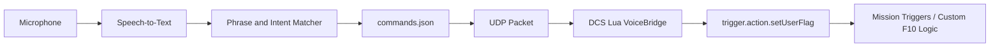

# Voice-Comms-DCS

Voice-Comms-DCS is a Windows desktop companion app for DCS World that lets pilots speak short phrases and convert them into mission-side actions, usually by setting DCS user flags that are wired to custom F10 radio menu logic.

The project is designed around a safe and mission-author-controlled bridge:



## Why this exists

DCS F10 radio menus are powerful but slow to use during high workload flying. This tool provides a configurable voice layer so mission builders can map phrases such as `request tanker`, `bogey dope`, or `abort mission` to deterministic DCS trigger flags.

## Important DCS limitation

DCS does not provide a simple public API for externally "clicking" any currently visible dynamic F10 menu item. The reliable approach is to design missions so voice commands set mission user flags, and mission triggers or Lua scripts then perform the desired action. Future adapters can target DCS-BIOS, DCS-gRPC, or a custom mission menu registry for deeper dynamic-menu awareness.

## Repository layout

```text
voice-comms-dcs/
├── README.md
├── LICENSE
├── requirements.txt
├── pyproject.toml
├── .gitignore
├── src/voice_comms_dcs/
│   ├── __init__.py
│   ├── main.py
│   ├── app.py
│   ├── audio.py
│   ├── config.py
│   ├── matcher.py
│   ├── network.py
│   ├── stt.py
│   └── ui.py
├── dcs_scripts/
│   ├── VoiceBridge.lua
│   ├── Export.lua.append.example
│   └── mission_trigger_example.lua
├── config/
│   └── commands.example.json
├── docs/
│   ├── architecture.md
│   ├── installer_roadmap.md
│   └── security_and_limitations.md
└── build/
    ├── build_exe.ps1
    ├── pyinstaller.spec
    └── voice-comms-dcs.iss
```

## Quick start

### 1. Install Python dependencies

Use Python 3.11 or newer on Windows.

```powershell
python -m venv .venv
.\.venv\Scripts\Activate.ps1
python -m pip install --upgrade pip
pip install -r requirements.txt
```

### 2. Copy the command configuration

```powershell
copy config\commands.example.json config\commands.json
```

Edit `config\commands.json` and map your spoken phrases to DCS user flags.

### 3. Install the DCS Lua bridge

Recommended development placement:

```text
%USERPROFILE%\Saved Games\DCS\Scripts\VoiceBridge.lua
```

Then append the content of `dcs_scripts/Export.lua.append.example` to:

```text
%USERPROFILE%\Saved Games\DCS\Scripts\Export.lua
```

If `Export.lua` does not exist, create it first.

### 4. Wire flags inside your mission

Use Mission Editor triggers or `DO SCRIPT` logic to respond to the flags sent by the app.

Example:

```lua
-- When flag 5101 becomes 1, run tanker request logic, then reset it.
if trigger.misc.getUserFlag("5101") == 1 then
    trigger.action.outText("Voice command received: Request Tanker", 10)
    trigger.action.setUserFlag("5101", 0)
end
```

A fuller example is provided in `dcs_scripts/mission_trigger_example.lua`.

### 5. Run the desktop app

```powershell
python -m voice_comms_dcs --config config\commands.json
```

Use the GUI to start listening. You can also type a phrase into the manual test box to validate command matching before connecting a microphone.

## Configuration example

```json
{
  "dcs_host": "127.0.0.1",
  "dcs_port": 10308,
  "matching": {
    "min_confidence": 0.78
  },
  "stt": {
    "engine": "vosk",
    "model_path": "models/vosk-model-small-en-us-0.15",
    "sample_rate": 16000
  },
  "commands": [
    {
      "id": "request_tanker",
      "phrases": ["request tanker", "tanker request", "texaco request rejoin"],
      "action": {
        "type": "flag",
        "flag": 5101,
        "value": 1
      }
    }
  ]
}
```

## UDP protocol

The desktop app sends one UDP packet per matched command:

```text
VCDCS|<command_id>|<action_type>|<param1>|<param2>
```

For a user flag command:

```text
VCDCS|request_tanker|flag|5101|1
```

The Lua bridge validates the `VCDCS` prefix, parses the fields, then calls `trigger.action.setUserFlag(flag, value)` when the mission scripting environment permits it.

## Packaging

The repository includes:

- `build/pyinstaller.spec` for a one-folder Windows build.
- `build/build_exe.ps1` for repeatable local packaging.
- `build/voice-comms-dcs.iss` as an Inno Setup installer template.

See `docs/installer_roadmap.md` for the release pipeline.

## Roadmap

- Add push-to-talk hotkey support.
- Add optional Windows Speech Recognition backend.
- Add optional Whisper.cpp backend for higher quality offline STT.
- Add DCS-BIOS or DCS-gRPC adapter for richer dynamic F10 menu introspection.
- Add mission-side command registry export so the UI can show currently available voice actions.

## License

MIT License. See `LICENSE`.
