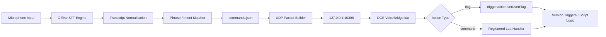

# Voice-Comms-DCS Architecture Report

## 1. Purpose

Voice-Comms-DCS provides a Windows desktop bridge between spoken pilot phrases and deterministic DCS World mission actions. The first release focuses on the most reliable integration path: recognised speech is matched to a configured command, sent over UDP, then converted into a DCS user flag that mission logic can consume.

This avoids brittle attempts to automate the live F10 radio UI directly and keeps the mission designer in control of every action triggered by voice.

## 2. High-level data flow



## 3. Layered design

### 3.1 Input layer

The input layer captures microphone audio from Windows through `sounddevice`. The current backend uses Vosk for offline speech-to-text. This keeps the application usable without an internet connection and avoids sending cockpit audio to a cloud service.

Future backends can be added behind the same listener interface:

- Whisper.cpp or faster-whisper for better accuracy.
- Windows Speech Recognition for users who want native Windows integration.
- OpenAI Whisper API as an optional cloud backend where privacy and connectivity requirements allow it.

### 3.2 Intelligence layer

The first implementation uses deterministic phrase matching rather than a large language model. This is intentional for safety. DCS mission actions should be predictable, auditable, and easy to debug.

The matcher supports:

- Exact phrase matches.
- Phrases embedded in longer transcripts.
- Fuzzy matching with a configurable confidence threshold.

Example:

```json
{
  "id": "request_tanker",
  "phrases": ["request tanker", "tanker request", "texaco request rejoin"],
  "action": {
    "type": "flag",
    "flag": 5101,
    "value": 1
  }
}
```

A future LLM-based intent parser can sit between STT and the deterministic matcher, but it should resolve to a known command ID only. It should not generate arbitrary Lua or uncontrolled DCS actions.

### 3.3 Integration layer

The Python app sends UDP packets to DCS on localhost port `10308`:

```text
VCDCS|request_tanker|flag|5101|1
```

The Lua bridge validates:

- Protocol prefix.
- Safe command ID format.
- Supported action type.
- Numeric flag ID for flag actions.

It then attempts to set the user flag through mission scripting APIs. In mission scripting contexts, this is direct via:

```lua
trigger.action.setUserFlag("5101", 1)
```

In Export.lua contexts, the bridge attempts to use a mission bridge where available. This is documented as a compatibility layer, not the preferred mission architecture.

### 3.4 Mission logic layer

Mission designers should wire voice actions to mission flags, triggers, or framework code. This is the cleanest way to integrate with DCS because F10 radio menu items are often dynamic and mission-specific.

Example mission pattern:

```lua
if trigger.misc.getUserFlag("5101") == 1 then
    trigger.action.outText("Voice command received: Request Tanker", 10)
    -- Execute tanker routing, spawn, tasking, or message logic.
    trigger.action.setUserFlag("5101", 0)
end
```

## 4. The F10 problem

DCS F10 radio menus are built dynamically by mission scripts using `missionCommands.addCommand`, `missionCommands.addSubMenu`, and related APIs. External applications generally do not have a safe, stable, public interface to inspect and click whichever F10 item is currently visible to the player.

For a robust first release, Voice-Comms-DCS does not try to emulate keyboard navigation such as `\`, `F10`, `F1`, `F2`, etc. That approach breaks easily when menu order changes.

Recommended design instead:

1. Treat voice commands as mission events.
2. Map spoken phrases to user flags or registered command names.
3. Let the mission own the final action.
4. Reset flags after handling them.

Future dynamic F10 support can be designed through one of these adapters:

- Mission-side command registry that mirrors available voice-capable commands to the desktop app.
- DCS-BIOS integration for cockpit/control bindings where applicable.
- DCS-gRPC integration for richer external mission control where available.
- A custom Lua wrapper around `missionCommands.addCommand` that records command IDs when menus are created.

## 5. UDP packet contract

### Flag action

```text
VCDCS|<command_id>|flag|<flag_number>|<flag_value>
```

Example:

```text
VCDCS|request_bogey_dope|flag|5102|1
```

### Named command action

```text
VCDCS|<command_id>|command|<command_name>
```

Named commands require the mission to register a Lua handler:

```lua
VoiceBridge.handlers["request_tanker"] = function(command_id)
    trigger.action.outText("Handled " .. command_id, 10)
end
```

## 6. Latency strategy

Expected latency is the sum of:

1. Microphone capture buffer.
2. STT recognition time.
3. Phrase matching time.
4. UDP dispatch time.
5. Lua polling interval.
6. Mission trigger response time.

Recommended tuning:

- Keep Vosk model small for low latency.
- Use short, distinct command phrases.
- Keep Lua polling around `0.10` seconds for near-real-time response.
- Avoid using cloud STT during multiplayer or high workload missions unless network latency is acceptable.
- Show the last transcript and last matched command in the UI for debugging.

## 7. Push-to-talk plan

The repository includes a config placeholder for push-to-talk. The intended design is:

1. Add a global hotkey listener.
2. Only pass audio frames to STT while the hotkey is held.
3. Show UI state: `Idle`, `PTT Held`, `Recognising`, `Command Sent`.
4. Add a short post-release grace window, for example 300 ms, to capture final syllables.

Recommended default: Right Ctrl or a joystick button mapped through a companion hotkey tool.

## 8. Security and safety principles

- The Lua bridge rejects packets without the `VCDCS` prefix.
- Command IDs must use safe identifier characters.
- Flag IDs must be numeric.
- The first release does not execute arbitrary Lua received over UDP.
- The desktop app binds outbound UDP only; DCS listens locally.
- Missions should use a reserved flag range to avoid collisions with unrelated trigger logic.

## 9. Release milestones

### v0.1 — Local prototype

- Python GUI.
- Vosk backend.
- Manual phrase test.
- UDP packet sender.
- Lua bridge.
- User flag actions.

### v0.2 — Usability pass

- Microphone selector.
- Push-to-talk.
- Command confidence display.
- Packaged `.exe` build.

### v0.3 — Mission-builder features

- Mission command registry.
- Export/import command profiles.
- Per-aircraft command profiles.
- Multiplayer-safe guidance.

### v1.0 — Product release

- Signed Windows installer.
- Documented DCS installation wizard.
- Stable protocol versioning.
- Example DCS missions.
