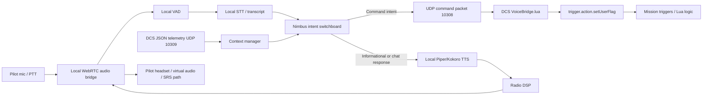
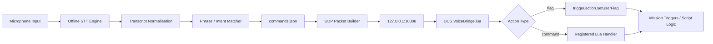
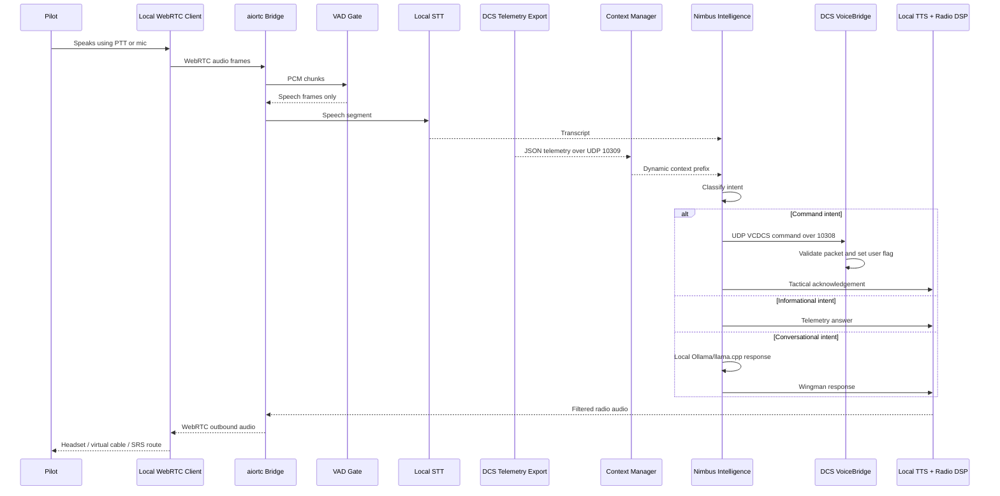

# Voice-Comms-DCS Architecture Report

## 1. Purpose

Voice-Comms-DCS is a local-first DCS World companion project. Phase 1 provides a safe one-way bridge from recognised pilot speech to mission-controlled DCS user flags. Phase 2 adds the Nimbus conversational cockpit layer: WebRTC audio, JSON telemetry ingestion, a telemetry-aware local AI switchboard, and radio-effect local TTS.

The design goal is immersion without unsafe automation. Voice-Comms-DCS does not execute arbitrary Lua, does not use cloud AI APIs, and does not rely on brittle keyboard automation to click dynamic F10 menu positions.

## 2. Architecture at a glance



## 3. Phase 1 command bridge

Phase 1 remains the safety-critical command path.



The Python app sends UDP packets to DCS on localhost port `10308`:

```text
VCDCS|request_tanker|flag|5101|1
```

The Lua bridge validates the protocol prefix, command ID, action type, and numeric flag values before setting mission flags.

## 4. Phase 2 conversational cockpit

Phase 2 adds these modules:

| Module | File | Responsibility |
|---|---|---|
| WebRTC bridge | `src/voice_comms_dcs/webrtc_bridge.py` | Local WebSocket signaling, aiortc peer connection, inbound/outbound audio tracks |
| Compatibility entrypoint | `src/voice_comms_dcs/webrtc_audio_server.py` | Alias entrypoint for the Phase 2 prompt naming |
| Telemetry listener | `src/voice_comms_dcs/telemetry_listener.py` | JSON-over-UDP listener for DCS state packets |
| DCS telemetry exporter | `dcs_scripts/dcs_telemetry.lua` | Export.lua telemetry collection and 10 Hz UDP send |
| Context manager | `src/voice_comms_dcs/context_manager.py` | Formats telemetry into a dynamic AI context prefix and state machine |
| Nimbus intelligence | `src/voice_comms_dcs/nimbus_intelligence.py` | Intent switchboard for command, informational, conversation, and warning responses |
| Radio voice | `src/voice_comms_dcs/radio_voice.py` | Piper TTS wrapper and radio-style DSP filter |
| Aircraft profiles | `src/voice_comms_dcs/aircraft_profiles.py` | Swappable aircraft/callsign/persona profiles |

## 5. Sequence diagram



## 6. Telemetry model

Telemetry is sent from DCS to Python as compact JSON on UDP `127.0.0.1:10309`.

Top-level shape:

```json
{
  "protocol": "VCDCS_TELEMETRY",
  "version": 1,
  "aircraft": {},
  "internal": {},
  "spatial": {},
  "tactical": {}
}
```

Required conceptual fields:

| Category | Examples |
|---|---|
| Internal | fuel total/internal, engine RPM, flaps, gear, G-load |
| Spatial | heading, altitude ASL/AGL, IAS/TAS, coordinates |
| Tactical | locked target range, velocity, bearing, RWR alert placeholders |

DCS module export APIs vary by aircraft. The Lua exporter is defensive and leaves unavailable values as `null`. Aircraft-specific RWR and radar adapters can be added later without changing the Python context interface.

## 7. Dynamic context window

The context manager converts telemetry into a compact prompt prefix:

```text
[Context: Mode: COMBAT; Alt ASL: 15000 ft; IAS: 410 kt; Fuel: 4200 kg; Locked range: 5 nm]
```

Combat mode is triggered when:

- G-load is greater than `4.0`.
- Locked target range is `10 nm` or less.
- RWR severity indicates `missile`, `launch`, `critical`, or `spike`.

In combat mode, Nimbus is constrained to short tactical responses of ten words or fewer.

## 8. Intent switchboard

Nimbus uses a hybrid strategy:

| Intent | Example | Behavior |
|---|---|---|
| Command | “Request tanker” / “Gear down” | Use deterministic command matcher and send UDP packet to DCS |
| Informational | “What is my fuel?” | Answer directly from telemetry |
| Conversational | “Talk me through the intercept” | Use local Ollama/llama.cpp-compatible model |
| Warning | RWR/missile/fuel priority | Override lower-priority outputs in combat mode |

Command intent remains deterministic so the LLM never invents DCS actions.

## 9. WebRTC and audio strategy

The WebRTC bridge keeps a local peer connection open for low-latency audio. In v0.2, it includes:

- WebSocket signaling endpoint at `/ws`.
- Health endpoint at `/health`.
- Inbound audio sink.
- Energy-based VAD fallback.
- Outbound Nimbus audio track.
- Test transcript path for integration before full STT chunking is completed.

Recommended PTT behavior:

1. Keep WebRTC connected continuously.
2. Gate speech processing with PTT or VAD.
3. Prefer PTT in combat to avoid false positives from DCS, SRS, breathing, and cockpit noise.
4. Add a 250 to 350 ms release grace window before finalising the utterance.

## 10. TTS and radio post-processing

`radio_voice.py` supports local Piper TTS first. The radio DSP chain applies:

1. 300 Hz to 3 kHz bandpass.
2. Gentle compression.
3. Slight white-noise overlay.
4. Output normalisation.

The result is designed to sound like an AI wingman/RIO coming through a cockpit radio rather than a clean desktop assistant voice.

## 11. Virtual audio / SRS strategy

The first Phase 2 implementation outputs Nimbus speech through the local WebRTC outbound audio track. Routing options:

| Route | Purpose |
|---|---|
| Headset output | Fastest test path |
| VB-Audio Virtual Cable | Route Nimbus to mixers, OBS, or SRS input chains |
| VoiceMeeter | Mix game, SRS, and Nimbus levels |
| SRS-specific integration | Later adapter for radio-channel realism |

## 12. Safety principles

- No cloud processing.
- No `os.execute` in Lua.
- No arbitrary Lua received over UDP.
- DCS actions use the existing Flag/Command bridge.
- UDP defaults to localhost only.
- Telemetry export is rate-limited to avoid DCS frame stutters.
- LLM output is never used as executable code.

## 13. Performance guidance

Recommended baseline:

- Keep DCS telemetry at 10 Hz until tested.
- Use small local LLMs such as 2B to 3B quantized models first.
- Use Vosk or Whisper.cpp small/base for local STT.
- Prefer Piper for low-latency CPU TTS.
- Keep context compact and cap combat-mode responses.

Typical overhead targets:

| Component | Practical target |
|---|---|
| Telemetry Lua | < 1 ms per export tick |
| Telemetry rate | 10 Hz default |
| WebRTC audio frame | 20 ms frames |
| Local LLM | 2B to 3B first; 7B only if spare VRAM exists |
| TTS | Short tactical replies under 1 second where possible |

## 14. Release milestones

### v0.1 — Command bridge

- Python GUI.
- Vosk backend.
- Manual phrase test.
- UDP packet sender.
- Lua bridge.
- User flag actions.

### v0.2 — Nimbus scaffold

- WebRTC bridge.
- Telemetry exporter and listener.
- Context manager.
- Combat-mode state machine.
- Local Ollama-compatible intelligence hook.
- Piper radio-voice DSP.
- Aircraft profiles.

### v0.3 — Real-time maturity

- Full STT from WebRTC audio chunks.
- Joystick/global-hotkey PTT.
- Browser/local WebRTC client UI.
- Aircraft-specific RWR adapters.
- SRS routing adapter.

### v1.0 — Product release

- Signed installer.
- DCS install helper with backups.
- Stable protocol versioning.
- Example missions.
- Performance benchmark guidance.
