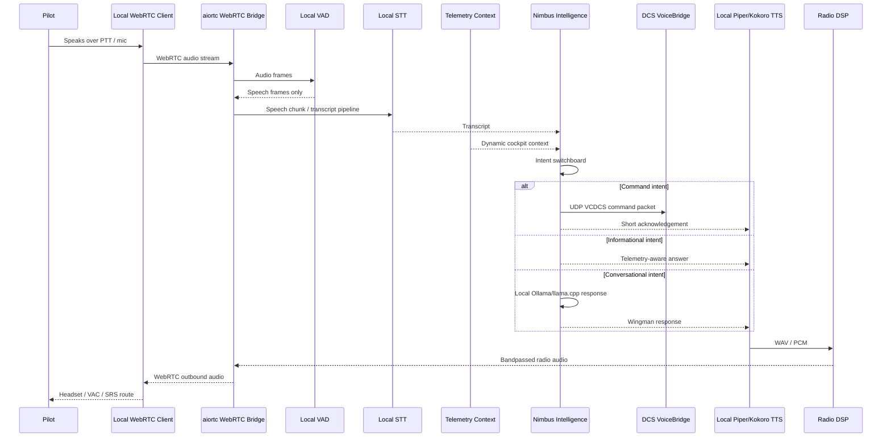

# Phase 2: Conversational Cockpit / Nimbus Integration

## Purpose

Phase 2 upgrades Voice-Comms-DCS from a one-way voice-command trigger into a local-first conversational cockpit assistant. Nimbus can receive pilot audio, ingest DCS telemetry, classify pilot intent, send safe command packets back to DCS, and reply using a local radio-effect voice.

The design remains conservative and simulation-safe:

- No cloud processing.
- No arbitrary Lua execution.
- No `os.execute` in DCS scripts.
- No direct dynamic F10 menu clicking by keyboard macro.
- DCS actions remain routed through the existing Flag/Command bridge.

## Sub-second audio and intelligence loop



## Runtime services

### 1. WebRTC bridge

File: `src/voice_comms_dcs/webrtc_bridge.py`

The bridge runs a local `aiohttp` server with:

- `GET /` simple status text.
- `GET /health` JSON health and latest context.
- `GET /ws` WebSocket signaling endpoint.

Default command:

```powershell
voice-comms-dcs-webrtc --config config\commands.json --aircraft-profile config\aircraft_profiles\su57.json
```

Default ports:

| Service | Port | Protocol | Direction |
|---|---:|---|---|
| Command bridge | 10308 | UDP | Python -> DCS |
| Telemetry stream | 10309 | UDP | DCS -> Python |
| WebRTC signaling | 8765 | WebSocket / HTTP | Local client -> Python |

### 2. Telemetry listener

File: `src/voice_comms_dcs/telemetry_listener.py`

Receives JSON-over-UDP packets from DCS and stores the latest snapshot. The listener is intentionally lightweight and callback-based so heavy AI work never blocks UDP receive.

Standalone test:

```powershell
voice-comms-dcs-telemetry --host 127.0.0.1 --port 10309
```

### 3. DCS telemetry exporter

File: `dcs_scripts/dcs_telemetry.lua`

Exports a compact telemetry packet roughly every 0.10 seconds by default.

Telemetry fields include:

```json
{
  "protocol": "VCDCS_TELEMETRY",
  "version": 1,
  "aircraft": {
    "name": "...",
    "type": "..."
  },
  "internal": {
    "fuel_total_kg": 4200,
    "fuel_internal_kg": 4200,
    "engine_rpm_left": 92,
    "engine_rpm_right": 92,
    "flaps": 0,
    "gear": 0,
    "g_load": 1.2
  },
  "spatial": {
    "heading_deg": 270,
    "altitude_asl_ft": 15000,
    "altitude_agl_ft": 12000,
    "ias_kt": 410,
    "tas_kt": 450,
    "lat": 0,
    "lon": 0
  },
  "tactical": {
    "locked_target": {
      "range_nm": 5,
      "bearing_deg": 60,
      "velocity_kt": 480
    },
    "rwr_alerts": []
  }
}
```

DCS module support varies. Some aircraft expose less data through Export.lua, especially RWR details. The exporter is written defensively and leaves unavailable fields as `null`.

### 4. Context manager

File: `src/voice_comms_dcs/context_manager.py`

Formats telemetry into the dynamic prompt prefix:

```text
[Context: Mode: COMBAT; Alt ASL: 15000 ft; IAS: 410 kt; Fuel: 4200 kg; Locked range: 5 nm]
```

Combat mode triggers:

- `g_load > 4.0`
- locked target range `<= 10 nm`
- priority RWR alert severity such as `missile`, `launch`, `critical`, or `spike`

In combat mode, Nimbus responses are trimmed to ten words or fewer.

### 5. Nimbus intelligence

File: `src/voice_comms_dcs/nimbus_intelligence.py`

Intent switchboard:

| Intent | Example | Behavior |
|---|---|---|
| Command | “Request tanker” | Uses existing command matcher and sends UDP command to DCS |
| Informational | “What’s my fuel?” | Answers from telemetry without needing the LLM |
| Conversational | “Talk me through the intercept” | Uses local Ollama-compatible chat endpoint |
| Warning | RWR/missile/fuel priority | Overrides normal response in combat mode |

Default local LLM endpoint:

```text
http://127.0.0.1:11434/api/chat
```

Recommended small local models:

- `qwen2.5:3b-instruct`
- `phi3:mini`
- `gemma2:2b`
- `llama3.2:3b`

### 6. Radio voice

File: `src/voice_comms_dcs/radio_voice.py`

The first TTS backend is Piper. The module generates WAV output and applies:

- 300 Hz to 3 kHz bandpass.
- Gentle compression.
- Slight white-noise overlay.
- Output normalisation.

Piper model example path:

```text
models/piper/en_US-lessac-medium.onnx
```

## Push-to-talk recommendation

Recommended Phase 2 behavior:

1. WebRTC connection remains open continuously.
2. Audio processing is gated by push-to-talk or VAD.
3. PTT is preferred for combat missions because DCS cockpit audio, engine noise, SRS, and breathing can cause false positives.
4. Continuous listen can be offered later as an opt-in mode for single-player testing.

Implementation target:

- Hold PTT -> accept audio frames into STT.
- Release PTT -> finalise utterance and run intent classification.
- Add a 250 to 350 ms release grace window to catch final syllables.

## Virtual audio and SRS routing strategy

The WebRTC bridge outputs Nimbus speech as an audio track. Routing options:

| Route | Use case |
|---|---|
| Default headset output | Fastest local test |
| VB-Audio Virtual Cable | Route Nimbus into a mixer or DCS/SRS input chain |
| VoiceMeeter | Mix Nimbus with game/SRS audio and control levels |
| SRS integration | Future work for realistic radio-channel injection |

The v0.2 implementation focuses on local WebRTC output. Direct SRS injection should be treated as a later integration layer to avoid coupling the core AI loop to one radio tool.

## Hardware expectations

These are practical estimates for running alongside DCS on one machine.

| Component | Light profile | Comfortable profile |
|---|---:|---:|
| STT | Vosk small CPU model | Whisper.cpp small/base on CPU or GPU |
| LLM | 2B to 3B quantized model | 7B quantized model if VRAM allows |
| TTS | Piper CPU | Piper/Kokoro with GPU optional |
| VRAM | 2 GB to 4 GB extra | 6 GB to 10 GB extra |
| CPU | 2 to 4 extra threads | 4 to 8 extra threads |
| RAM | 2 GB to 4 GB extra | 6 GB to 12 GB extra |

Recommended for DCS plus local AI:

- 32 GB RAM minimum; 64 GB+ preferred.
- 8-core modern CPU minimum; 12-core+ preferred.
- GPU with spare VRAM if using a 7B local model.
- Keep telemetry at 10 Hz unless testing proves higher rates are safe.

## Performance guardrails

- Keep DCS Lua export at 10 Hz by default.
- Avoid expensive Lua table scans per frame.
- Keep UDP packets compact.
- Do not block Export.lua callbacks.
- Keep LLM calls outside the telemetry receive loop.
- Prefer short prompts and small context windows.
- Use combat mode to reduce LLM output tokens.

## Packaging notes

PyInstaller must include:

- `aiortc`, `aiohttp`, `av`, `numpy`, `scipy`, `requests`
- `dcs_scripts/dcs_telemetry.lua`
- `config/aircraft_profiles/*`
- Phase 2 docs

TTS binaries and model files are intentionally not committed. Installer options:

1. Bundle Piper executable and one small voice model in a later release.
2. Ask the user to install Piper separately and set the model path.
3. Add an installer task to download models only if the user explicitly opts in.

## Current implementation status

Implemented in v0.2 scaffold:

- WebRTC bridge and WebSocket signaling skeleton.
- Inbound VAD-gated audio capture.
- Outbound WebRTC audio track.
- JSON-over-UDP DCS telemetry listener.
- DCS telemetry Lua exporter.
- Telemetry context manager.
- Combat-mode state machine.
- Local Ollama-compatible intelligence hook.
- Piper radio-voice post-processing.
- Aircraft profile loader.

Still to mature:

- Full STT from WebRTC audio chunks.
- Joystick/global-hotkey PTT capture.
- Browser/local client UI for WebRTC offer generation.
- SRS-specific audio injection.
- Aircraft-specific RWR adapters.
- Runtime benchmark tests inside DCS.
