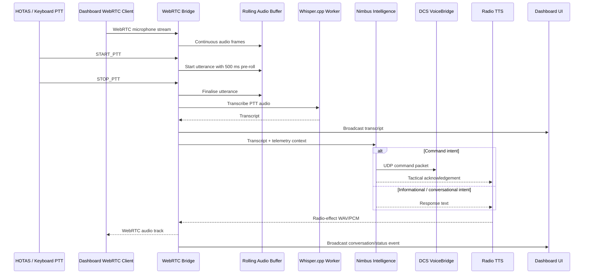

# Phase 3: Front-End & High-Fidelity Expansion

## Purpose

Phase 3 turns Nimbus from a backend proof-of-concept into a usable simulation product. It adds high-fidelity local STT, physical PTT input, a browser-based glass-cockpit dashboard, and robust audio chunking so the pilot can interact naturally while DCS remains the active window.

The design remains local-first:

- No cloud STT.
- No cloud LLM.
- No cloud TTS.
- WebRTC signaling binds to `127.0.0.1` by default.
- HOTAS input is read in non-exclusive polling mode.
- DCS commands continue through the existing UDP Flag/Command bridge.

## Phase 3 flow



## New modules

| Module | Responsibility |
|---|---|
| `input_manager.py` | Global keyboard PTT via `pynput`, non-exclusive joystick/HOTAS polling via `pygame.joystick` |
| `stt_whisper_engine.py` | Whisper.cpp wrapper, CLI fallback, audio normalisation, cockpit-noise filtering, rolling buffer |
| `api_routes.py` | Dashboard HTTP routes and live WebSocket status stream |
| `web_ui/index.html` | Dashboard structure and controls |
| `web_ui/style.css` | Glass-cockpit dashboard styling |
| `web_ui/app.js` | WebRTC client, dashboard telemetry updates, transcript tests, PTT controls |
| `build/setup_whisper.ps1` | Downloads Whisper.cpp `tiny.en`, `base.en`, or `small.en` models |

## Whisper.cpp STT

Phase 3 defaults to Whisper.cpp-style local STT through `stt_whisper_engine.py`.

Recommended models:

| Model | Use case | Notes |
|---|---|---|
| `tiny.en` | Fastest command tests | Best latency, lower accuracy |
| `base.en` | Recommended default | Good balance for DCS commands |
| `small.en` | Higher accuracy | Use only if CPU/GPU headroom allows |

Setup:

```powershell
.\build\setup_whisper.ps1 -Model base.en
```

Diagnostic transcription:

```powershell
voice-comms-dcs-whisper --model models\whisper\ggml-base.en.bin --wav samples\test_command.wav
```

The Whisper engine performs:

1. Mono conversion.
2. DC offset removal.
3. Peak normalisation.
4. Resampling to 16 kHz.
5. 120 Hz to 7.6 kHz bandpass to reduce rumble and high-frequency cockpit whine.
6. Binding-based transcription if available.
7. CLI fallback via `whisper-cli`.

## Rolling audio buffer and pre-roll

The rolling buffer continuously stores recent audio, even when PTT is not active. On PTT start, it prepends the last 500 ms of audio to the active utterance.

Reason:

- Physical PTT presses often happen a fraction of a second after the pilot starts speaking.
- Without pre-roll, the first word of a command can be clipped.
- Pre-roll improves recognition of commands such as “request tanker” and “gear down.”

Default values:

| Setting | Default |
|---|---:|
| STT sample rate | 16 kHz |
| Pre-roll | 500 ms |
| WebRTC frame size | 20 ms |
| PTT release grace target | 300 ms |

## Physical PTT

`input_manager.py` supports two PTT paths:

### Keyboard

Uses `pynput` for global keyboard capture. This does not require the Python window to be focused, so DCS can remain active.

Default:

```text
right_ctrl
```

### HOTAS / joystick

Uses `pygame.joystick` polling. This reads device state without exclusive acquisition, so it should not block DCS from receiving the same joystick input.

List devices:

```powershell
voice-comms-dcs-input --list
```

Test a binding:

```powershell
voice-comms-dcs-input --joystick-index 0 --button-index 1 --hotkey right_ctrl
```

Launch WebRTC bridge with a HOTAS button:

```powershell
voice-comms-dcs-webrtc `
  --config config\commands.json `
  --aircraft-profile config\aircraft_profiles\su57.json `
  --whisper-model models\whisper\ggml-base.en.bin `
  --joystick-index 0 `
  --joystick-button 1 `
  --ptt-hotkey right_ctrl
```

## Dashboard

The dashboard is served by the Python backend at:

```text
http://127.0.0.1:8765/dashboard
```

Features:

- WebRTC connect button.
- Browser microphone permission path.
- Conversation terminal.
- Manual transcript test input.
- PTT start/stop test buttons.
- Live telemetry gauges for fuel, altitude, IAS, and G-load.
- Context-window view.
- AI personality selector placeholder.
- Live WebSocket status updates at `/api/live`.

## Local endpoints

| Endpoint | Purpose |
|---|---|
| `/dashboard` | Main UI |
| `/web_ui/app.js` | Dashboard JavaScript |
| `/web_ui/style.css` | Dashboard styling |
| `/api/status` | One-shot dashboard status JSON |
| `/api/live` | Live status/conversation WebSocket |
| `/ws` | WebRTC signaling WebSocket |
| `/health` | Bridge health JSON |

## Programmer logic verification

### 1. Latency check

Target:

```text
PTT release -> DCS command executed < 1.5 seconds
Preferred target < 1.0 second
```

Current implementation records the STT latency in dashboard events as `stt_latency_seconds` and `total_elapsed_seconds`.

Recommended test procedure:

1. Use `tiny.en` first.
2. Test `request tanker` through manual transcript to isolate DCS command latency.
3. Test the same command through PTT + Whisper.
4. Check dashboard event timing.
5. If above target, reduce model size, reduce LLM use for command paths, or switch command phrases to deterministic matching.

### 2. HID conflict check

Expected behavior:

- `pygame.joystick` polling reads state and does not acquire the device exclusively.
- DCS should continue receiving the same joystick button if it is mapped in-game.

Recommended test procedure:

1. Run `voice-comms-dcs-input --list`.
2. Run the input diagnostic command.
3. Launch DCS controls tester or a quick mission.
4. Press the selected HOTAS button.
5. Confirm both DCS and Voice-Comms-DCS see the button.

### 3. Resource load check

Target:

- DCS remains at or above the user’s normal frame-rate target.
- Telemetry exporter remains at 10 Hz.
- Whisper inference uses `tiny.en` or `base.en` for command mode.
- Local LLM is kept small, ideally 2B to 3B quantized.

Recommended mid-range profile:

| Component | Recommended setting |
|---|---|
| STT | Whisper.cpp `tiny.en` or `base.en` |
| LLM | 2B/3B quantized local model |
| TTS | Piper CPU |
| Telemetry | 10 Hz |
| Dashboard | Local browser only |

## Known limitations

- Full benchmark validation inside DCS has not been performed from this environment.
- Browser dashboard WebRTC is implemented, but real-world browser/device testing is still required.
- Joystick button numbering varies by HOTAS vendor and Windows driver.
- `whisper-cpp-python` installation may require a compiler on some systems; CLI fallback is provided.
- AI personality selector is currently a front-end placeholder for a future backend setting.
- SRS direct injection remains future work.
